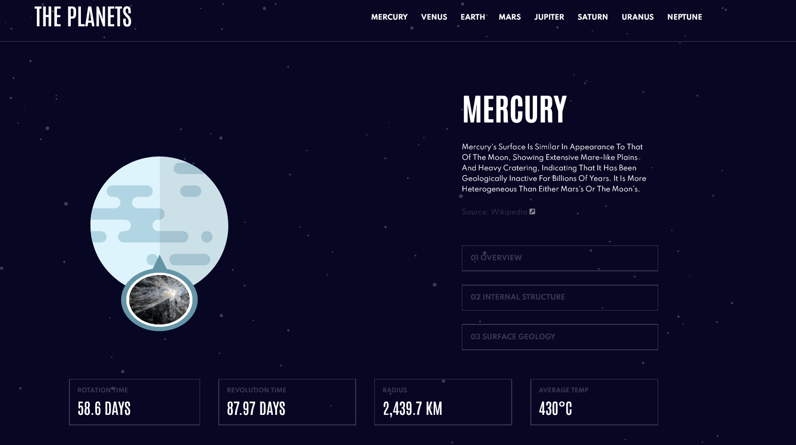
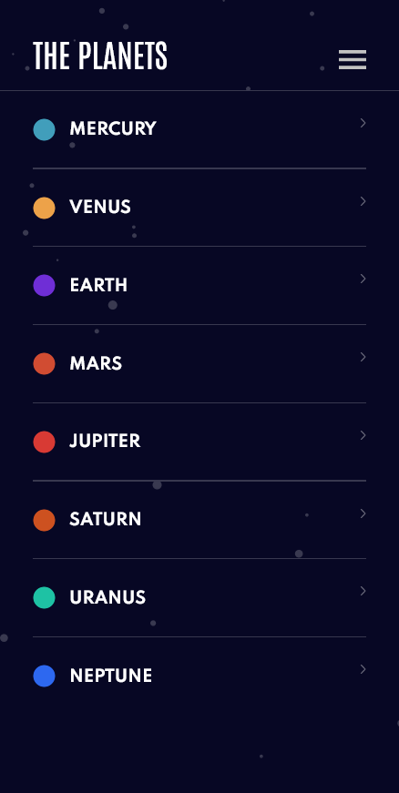

# Frontend Mentor - Planets fact site solution

This is a solution to the [Planets fact site challenge on Frontend Mentor](https://www.frontendmentor.io/challenges/planets-fact-site-gazqN8w_f). Frontend Mentor challenges help you improve your coding skills by building realistic projects. 

## Table of contents

- [Overview](#overview)
  - [The challenge](#the-challenge)
  - [Screenshot](#screenshot)
  - [Links](#links)
- [My process](#my-process)
  - [Built with](#built-with)
  - [What I learned](#what-i-learned)
  - [Continued development](#continued-development)
  - [Useful resources](#useful-resources)
  -[Acknowledgement](#acknowledgement)
- [Author](#author)


## Overview

### The challenge

Users should be able to:

- View the optimal layout for the app depending on their device's screen size
- See hover states for all interactive elements on the page
- View each planet page and toggle between "Overview", "Internal Structure", and "Surface Geology"

### Screenshot




### Links

- Live Site URL: [View live page here](http://planets-fact-site-nu.vercel.app/)

## My process

### Built with

- Semantic HTML5 markup
- CSS custom properties
- Flexbox
- CSS Grid
- Mobile-first workflow

### What I learned

Working at this project it seemed easy at first glance but i dealt with things worth to mention.
The circles, i thought i could set some padding, border radius, width and height but it was hard
to make a perfect little round shape so i learned shape-outside and clip-path properties that did a perfect job,
i was quite satisfied with the result.

```css
 .circle {
    width: 1.25em;
    height: 1.25em;
    margin-right: 1.5em;
    shape-outside: circle();
    clip-path: circle();
    }
```



Ok, and now the hardest step: As you have noticed the responsive layout changes depending on the device. Making it full responsive
was hard as hell, the header heading move from center to inline along with the navigation; the surface image is overlapped, the tab component
does not only move but it changes, completely! So, this project pushed me towards grid technique, (i had a basic and very limited knowledge),
i can't deny there was a lot of trouble shooting, but eventually i learned how to virtually visualize the grid in my head, of course this is just
the beginning there's much more to learn.


### Continued development

I want to get better at code indentation, correct class naming and commenting; i tried to follow some of this
[css guidelines](https://cssguidelin.es/) though i discovered the website nearly at the end of the project. I fixed something
but there's room for improvements.


### Useful resources

Thanks to [Kevin Powell](https://www.youtube.com/watch?v=HFG3BKOqOlE) lesson on how to overlap content with grid.


### Acknowledgement

Thanks to [@emestabillo](https://www.frontendmentor.io/profile/emestabillo) for solving a problem i dealt with for hours.
The svg burger icon changes color when clicked. She suggested to set the opacity at 25% and it works, finally the color
matches the design.


## Author

- Frontend Mentor - [@Da-vi-de](https://www.frontendmentor.io/profile/Da-vi-de)